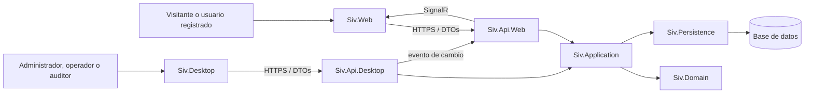
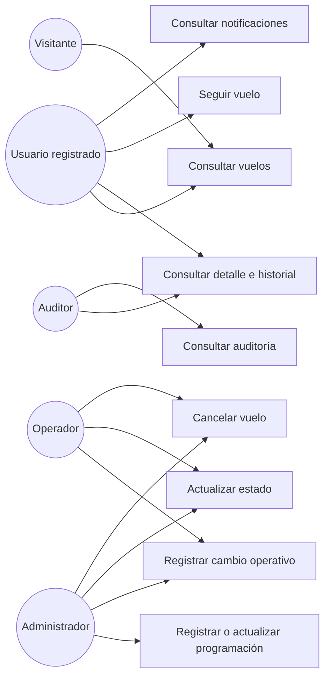
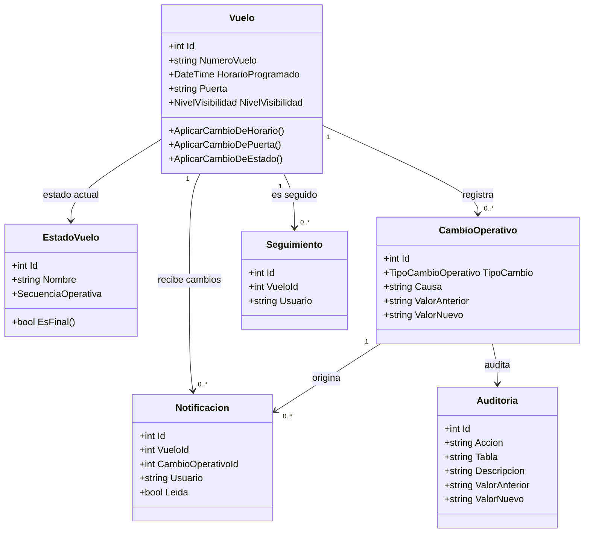
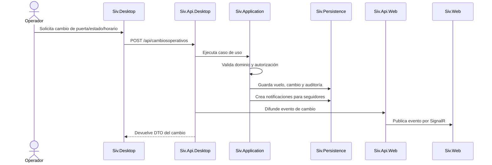

# Entregable 2: Arquitectura y diseño UML

## 1. Decisión arquitectónica

El SIV utiliza una arquitectura limpia con separación por responsabilidades. El dominio contiene entidades, enumeraciones, invariantes e interfaces de repositorio. La aplicación contiene casos de uso, DTOs, mapeadores e interfaces de servicios. Persistence implementa acceso a datos. Las APIs exponen contratos HTTP y las aplicaciones Web y Desktop funcionan como clientes de sus APIs respectivas.

La decisión permite:

- Evitar que la lógica de negocio dependa de MVC, WPF o Entity Framework.
- Compartir reglas entre Web y Desktop.
- Mantener APIs con responsabilidades distintas.
- Probar los casos de uso sin depender de una interfaz gráfica.
- Sustituir persistencia o mecanismos de notificación mediante interfaces.

## 2. Aplicaciones y proyectos

| Aplicación o capa | Proyecto | Responsabilidad |
|---|---|---|
| Cliente Web | `Siv.Web` | MVC, vistas, autenticación del usuario y adaptadores HTTP hacia API Web. |
| Cliente Desktop | `Siv.Desktop` | WPF/MVVM, operación interna, auditoría y adaptadores HTTP hacia API Desktop. |
| API pública | `Siv.Api.Web` | Consulta pública, seguimiento, reservas, notificaciones Web y Hub SignalR. |
| API operativa | `Siv.Api.Desktop` | Gestión operativa, catálogos, estados, auditorías y coordinación con API Web. |
| Casos de uso | `Siv.Application` | Servicios de vuelos, cambios, seguimiento, notificación, auditoría y reservas. |
| Núcleo | `Siv.Domain` | Entidades y reglas invariantes del negocio. |
| Persistencia | `Siv.Persistence` | DbContext, configuraciones, migraciones, repositorios y Unit of Work. |
| Pruebas | `Siv.Tests` | Pruebas unitarias y de integración de los flujos principales. |

## 3. Módulos de la solución

### Dominio

- Vuelos y programación.
- Estados y ciclo de vida.
- Cambios operativos.
- Seguimientos.
- Notificaciones.
- Auditoría.
- Reservas, usuarios, aerolíneas, aeropuertos y puertas.

### Aplicación

- `VueloServicio` y `IVueloServicio`.
- `CambioOperativoServicio` e `ICambioOperativoServicio`.
- `SeguimientoServicio` e `ISeguimientoServicio`.
- `NotificacionServicio` e `INotificacionServicio`.
- `AuditoriaServicio` e `IAuditoriaServicio`.
- Servicios de catálogos, estados, historial, usuarios y reservas.

### API Web

- Controladores de vuelos, aerolíneas, aeropuertos, estados, seguimientos, notificaciones, reservas y autenticación.
- `AuditoriaLecturaFilter` para registrar lecturas exitosas.
- `NotificacionesHub` y `NotificadorSignalR` para tiempo real.

### API Desktop

- Controladores de vuelos, cambios operativos, estados, historial, puertas, catálogos, seguimientos, notificaciones, auditorías y autenticación.
- `NotificadorApiWeb` para reenviar eventos de cambios a la API Web.

## 4. Relaciones entre aplicaciones

## 5. Casos de uso principales

## 6. Clases principales

## 7. Flujo de un cambio operativo

## 8. Mapeo de reglas a módulos

| Regla | Dominio | Aplicación | API o cliente |
|---|---|---|---|
| RN-01 Visibilidad | `PoliticaVisibilidadVuelo` | `VueloServicio` | API Web y API Desktop |
| RN-02 Programación válida | `Vuelo` | `VueloServicio` | `VuelosController` |
| RN-03 Seguimiento | `Seguimiento` | `SeguimientoServicio` | `SeguimientosController` Web/Desktop |
| RN-04 Cambios operativos | `Vuelo`, `CambioOperativo` | `CambioOperativoServicio` | `CambiosOperativosController` |
| RN-05 Vuelo cancelado | `CicloDeVidaVuelo` | `CambioOperativoServicio` | API Desktop |
| RN-06 Secuencia de estados | `EstadoVuelo`, `CicloDeVidaVuelo` | `VueloServicio` | API Desktop |
| RN-07 Notificaciones | `Notificacion` | `NotificacionServicio` | API Web, API Desktop, SignalR |
| RN-08 Auditoría | `Auditoria` | `AuditoriaServicio` | Filtro Web y API Desktop |
| RN-09 Autorización | — | — | `[Authorize]` en controladores |

## 9. Contratos entre aplicaciones

La integración se realiza mediante HTTP y DTOs. Las rutas principales son:

| Consumidor | Proveedor | Operación |
|---|---|---|
| `Siv.Web` | `Siv.Api.Web` | Consulta de vuelos, autenticación, seguimiento, reservas y notificaciones. |
| `Siv.Desktop` | `Siv.Api.Desktop` | Administración de vuelos, cambios operativos, catálogos, estados y auditoría. |
| `Siv.Api.Desktop` | `Siv.Api.Web` | Difusión de eventos de cambios operativos. |
| `Siv.Api.Web` | `Siv.Web` | Actualización en tiempo real mediante SignalR. |

Las URLs se configuran por aplicación y no deben codificarse dentro de los casos de uso. La implementación actual utiliza `ApiWeb:UrlBase` para Web y `ApiDesktop:UrlBase` para Desktop.
